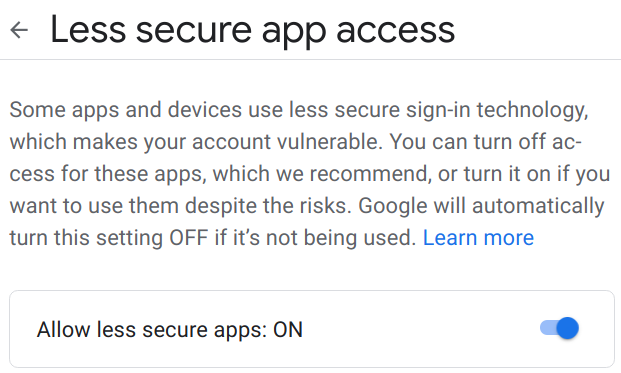
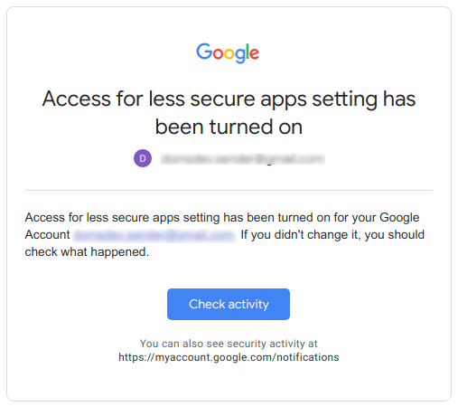
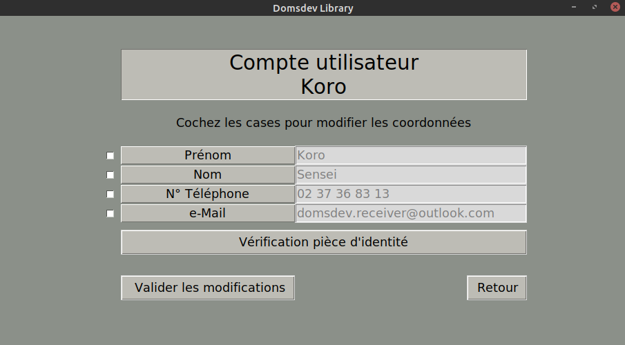
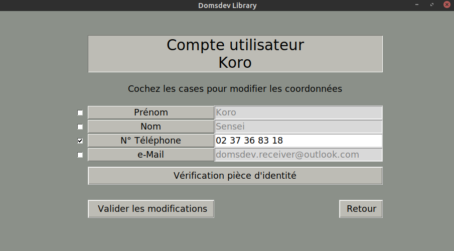

# Library Managment Interface

---

#### In this repository you will find the code and elements I used to create a desktop application for the managment of a library using Python, Tkinter and MySQL. I created this app as a concrete exemple to put into practice the skills I acquired during training courses in Python and SQL. The app is still under construction!

---

## Requirements

**MySQL server installed and configured for a user:** sudo apt-get install mysql-server 
**MySQL Connector:** pip3 install mysql-connector-python 
  
**Need to create environment variables to make the application run without modifications, adding the following two lines at the end of my .bashrc file** 
export MYSQL_USER='username' 
export MYSQL_PASSWORD='password' 
  
**Tkinter:** sudo apt-get install python3-tk 
**pil.imagetk:** sudo apt-get install python3-pil.imagetk 
  
**Sending mails with smtplib: I created and configured a dedicated gmail adress (normaly set by the administrator of the library) in order to send emails with an activation code when a new user of the library is registered. Then, the user will be able to connect to the interface and connect to its newly created account by entering its activation code.**  
  
Gmail by default tries to make your email secure by preventing this type of third-party access. You can manage your gmail security settings by allowing less secure apps.  
  

  
  
I allowed less secure apps only to test the code and experiment with it. I recommend to return your security settings back to its defaults when finished.  
If you don’t want to lower the security settings of your Gmail account, check out Google’s documentation on how to gain access credentials for your Python script, using the OAuth2 authorization framework.  
  
**Need to create environment variables as well for mail authentication, adding the following two lines at the end of my .bashrc file** 
export SENDER_MAIL='email-adress' 
export PASSWORD_MAIL='password' 

## Test the application

### Clone the repository

### Create two databases: "dewey_classification" and "library"

### Built and fill the databases using python scripts in the dedicated folder.

### Launch the application using the python script.

### Now you can see the app welcome page!

### Let's imagine that a librarian wants to connect to its own account:

### If you look the tables in the library database, and in the "User" table, you will find exemples of users I already created. Note that for this exercice I did not encrypt passwords (maybe in future developments).

### Ok now let's connect to the "libra" user account!

### And create a new User account.

### When entering informations, errors are handled specifically for each field (empty, not valid ...).

### Imagine the librarian has scanned the identity card of the new user to its computer desktop. The document will be inserted in the database for later consultation if needed.

### If an error occurs, this one is reported in a specific file for later consulation by administrator.

**In this case it was a smtplib credentials problem (forgot to allow Gmail less secure apps option)

### But now it is ok ... a mail with activation code has been sent to the new user's mail adress.

### Back to welcoming page, the user can select the account activation button.

### The user will be asked for a Pseudo and Password, then he will be able to connect normally to its account.

### A librarian can search for a user account

### Check the selected user account

### And modify/update entries if needed

### A librarian can also search for a book reference (I used Full-Text Search Functions of MySQL)

### Or can create a new reference and find the right category of a book using the Dewey Classification

