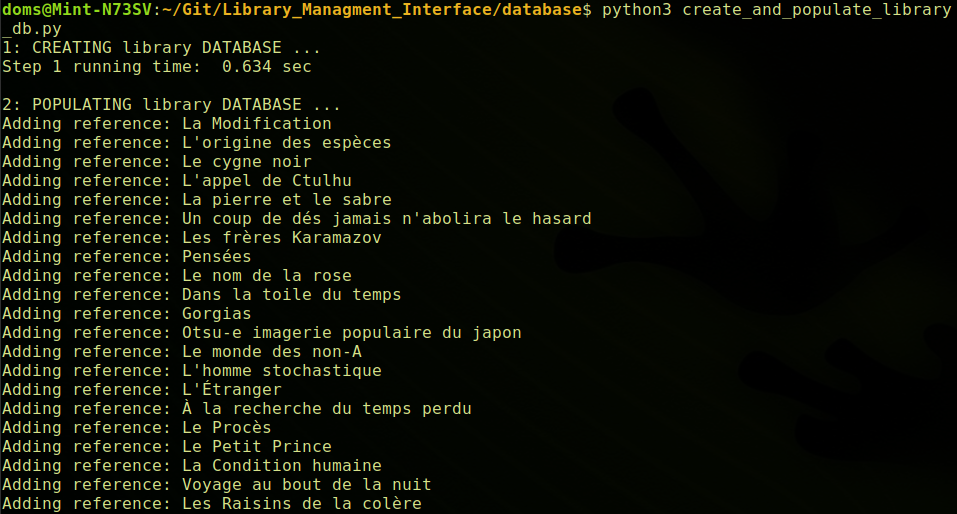
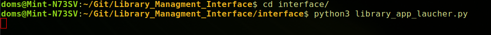
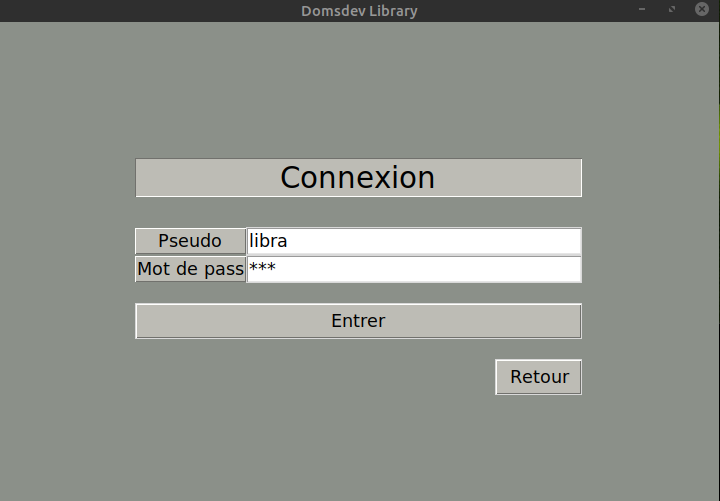
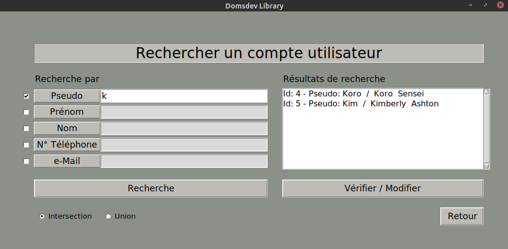
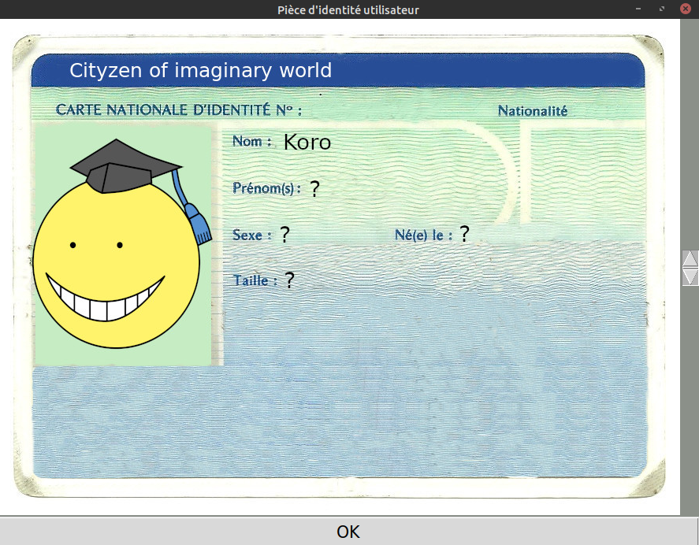

# Library Managment Interface

---

### In this repository you will find the code and elements I used to create a desktop application for the managment of a library using Python, Tkinter and MySQL. I created this app as a concrete exemple to put into practice the skills I acquired during training courses in Python and SQL. The app is still under construction!

---

## Requirements

**MySQL server installed and configured for a user:** sudo apt-get install mysql-server 
**MySQL Connector:** pip3 install mysql-connector-python 
  
**Need to create environment variables to make the application run without modifications, adding the following two lines at the end of my .bashrc file** 
export MYSQL_USER='username' 
export MYSQL_PASSWORD='password' 
  
**Tkinter:** sudo apt-get install python3-tk 
**pil.imagetk:** sudo apt-get install python3-pil.imagetk 
**Sendmail:** pip3 install sendmail 

## Test the application

### Clone the repository

### Create two databases: "dewey_classification" and "library"

### Built and fill the databases using python scripts in the dedicated folder

### Launch the application using the python script

### Now you can see the app welcome page!

### Let's imagine that a librarian wants to connect to its account:

### If you look the tables in the library database, and in the "User" table, you will find exemples of users already created. Note that for this exercice I did not encrypt passwords (maybe in future developments).

### Ok now let's connect to the "libra" user account!

### A librarian can search for a user account

### Can create a new reference and find the right category of a book using the Dewey Classification

